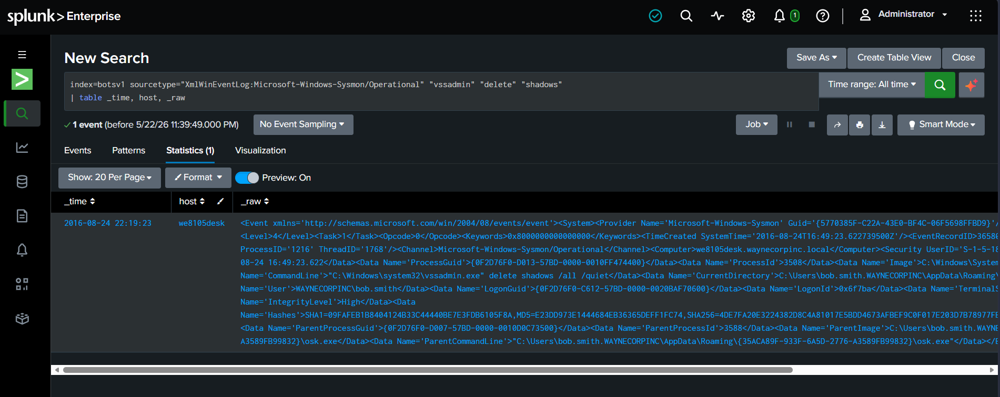

# 🚨 Incident Report: #SOC-ADV-001
**Status:** ✅ Closed | **Priority:** 🔴 Critical | **Assigned To:** Pranit Kalambate

---

## 📋 Ticket Overview
* **Alert Title:** Ransomware Activity Detected (Shadow Copy Deletion)
* **Target Environment:** On-Premises Endpoint (Windows Desktop)
* **Telemetry Source:** `XmlWinEventLog:Microsoft-Windows-Sysmon/Operational`
* **Affected Host:** `we8105desk.waynecorp.inc` (Bob Smith)

---

## 🌍 Real-World Scenario & Incident Context
The SOC dashboard triggered a critical severity alert for an endpoint exhibiting ransomware-like behavior. Modern ransomware families (such as Cerber) execute specific commands immediately upon infection to maximize impact. One of the most common pre-encryption tactics is destroying local system backups (Volume Shadow Copies) to prevent the victim from restoring their files without paying the ransom.

---

## 🕵️‍♂️ SOC Analyst Investigation Logic & Countermeasures

### ⚙️ Endpoint Telemetry Analysis (Sysmon)
When initial searches relying on parsed fields (like `CommandLine`) failed due to log ingestion anomalies, I pivoted to a **raw text search** across Sysmon logs to prevent false negatives. This successfully uncovered the living-off-the-land (LotL) binary being abused.
- **Malicious Command Executed:** `vssadmin.exe delete shadows /all /quiet`
- **Compromised Host:** `we8105desk`
- **Compromised User:** `bob.smith`

### 🗺️ MITRE ATT&CK Mapping
- **Tactics:** Impact (TA0040)
- **Technique:** `T1490 - Inhibit System Recovery`
- **Analyst Conclusion:** The execution of the `vssadmin delete shadows` command is a definitive indicator of a ransomware infection. The adversary is actively destroying recovery mechanisms. The immediate incident response action is to completely isolate the host `we8105desk` from the corporate network to prevent lateral movement and further file encryption.

**Visual Evidence:** 

---

## 💻 Technical Evidence (Advanced SPL Query)
```splunk
index=botsv1 sourcetype="XmlWinEventLog:Microsoft-Windows-Sysmon/Operational" "vssadmin" "delete" "shadows"
| table _time, host, _raw
