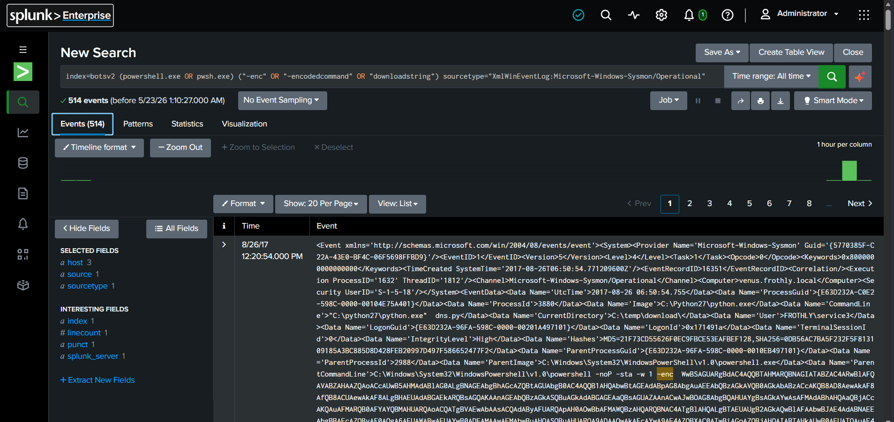

# 🚨 Incident Report: #SOC-ADV-002
**Status:** ✅ Closed | **Priority:** 🔴 High | **Assigned To:** Pranit Kalambate

---

## 📋 Ticket Overview
* **Alert Title:** Malicious PowerShell Payload Detection
* **Target Environment:** Endpoint Infrastructure (`venus.frothly.local`)
* **Telemetry Source:** `XmlWinEventLog:Microsoft-Windows-Sysmon/Operational`
* **Compromised Account:** `FROTHLY\service3`

---

## 🌍 Real-World Scenario
An automated SOC alert flagged suspicious PowerShell activity involving obfuscated commands. Threat actors frequently use encoded PowerShell payloads (`-enc` flag) to execute malicious scripts directly in memory, bypassing standard disk-based antivirus signatures. The goal was to confirm the execution and capture the malicious command line for forensic analysis.

---

## 🕵️‍♂️ SOC Analyst Investigation Findings
1. **Detection:** I successfully isolated 514 events related to obfuscated PowerShell execution.
2. **Analysis:** The command line confirmed the use of `-noP -sta -w 1 -enc` flags. Specifically, the `-w 1` (WindowStyle Hidden) flag was used to hide the execution from the end-user, and the `-enc` flag confirmed the presence of a Base64 encoded payload.
3. **Attribution:** The activity originated from the `service3` account on the host `venus.frothly.local`.

---
**Visual Evidence:** 
## 💻 Technical Evidence

### SPL Query Executed
```splunk
index=botsv2 (powershell.exe OR pwsh.exe) ("-enc" OR "-encodedcommand" OR "downloadstring") sourcetype="XmlWinEventLog:Microsoft-Windows-Sysmon/Operational"
