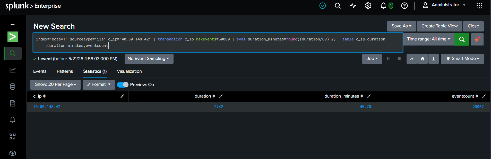

# 🚨 Incident Report: #SOC-2026-003
**Status:** ✅ Closed | **Priority:** 🟠 Medium | **Assigned To:** Pranit Kalambate

---
## 📋 Ticket Overview
* **Alert Title:** Prolonged Malicious Web Session (Campaign Duration)
* **Target Server:** Web Server (IIS)
* **Telemetry Source:** `index=botsv1` | `sourcetype=iis`

---
## 🕵️‍♂️ Investigation & Findings

### ⏱️ Attack Timeline Analysis
- **Attacker IP:** `40.80.148.42`
- **Total Attack Duration (Seconds):** `2742`
- **Total Attack Duration (Minutes):** `45.70`
- **Visual Evidence:**


---
## 💻 Technical Evidence (SPL Query)
```splunk
index="botsv1" sourcetype="iis" c_ip="40.80.148.42" | transaction c_ip maxevents=50000 | eval duration_minutes=round((duration/60),2) | table c_ip, duration, duration_minutes, eventcount
