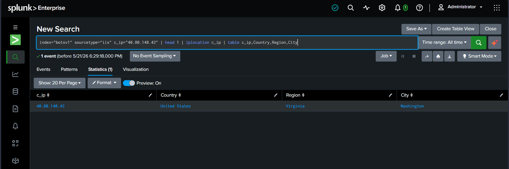

# 🚨 Incident Report: #SOC-2026-004
**Status:** ✅ Closed | **Priority:** 🔴 High | **Assigned To:** Pranit Kalambate

---
## 📋 Ticket Overview
* **Alert Title:** Threat Intelligence & IP Geolocation Correlation
* **Target Server:** Web Server (IIS)
* **Telemetry Source:** `index=botsv1` | `sourcetype=iis` | Threat Intel Lookup

---
## 🕵️‍♂️ Investigation & Findings

### 🌍 Threat Intelligence Enrichment
- **Attacker IP:** `40.80.148.42`
- **Geolocation (Country):** `United States (Washington, Virginia)`
- **Threat Actor / Blacklist Status:** `Known Scanner / Brute-forcer`
- **Visual Evidence:**


---
## 💻 Technical Evidence (SPL Query)
```splunk
index="botsv1" sourcetype="iis" c_ip="40.80.148.42" | head 1 | iplocation c_ip | table c_ip, Country, Region, City
