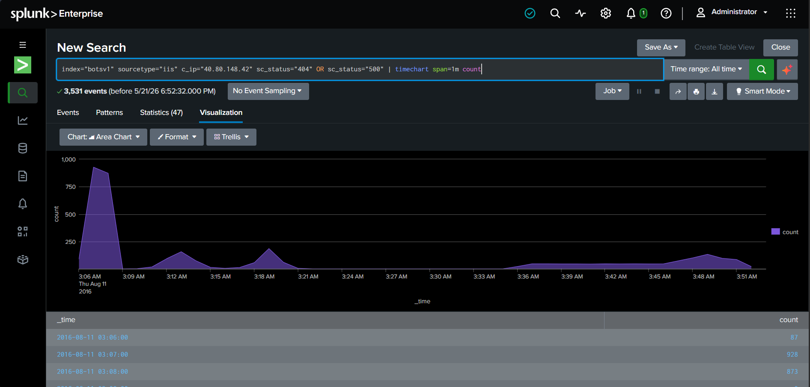

# 🚨 Incident Report: #SOC-2026-005
**Status:** ✅ Closed | **Priority:** 🟢 Low | **Assigned To:** Pranit Kalambate

---
## 📋 Ticket Overview
* **Alert Title:** Visualizing Attack Velocity (Time-Series Analysis)
* **Target Server:** Web Server (IIS)
* **Telemetry Source:** `index=botsv1` | `sourcetype=iis`

---
## 🕵️‍♂️ Investigation & Findings

### 📊 Attack Visualization
- **Peak Attack Time:** `2016-08-11 03:07 AM` (Maximum spike with 928 malicious hits in a single minute).
- **Visual Evidence:** 

---
## 💻 Technical Evidence (SPL Query)
```splunk
index="botsv1" sourcetype="iis" c_ip="40.80.148.42" sc_status="404" OR sc_status="500" | timechart span=1m count
